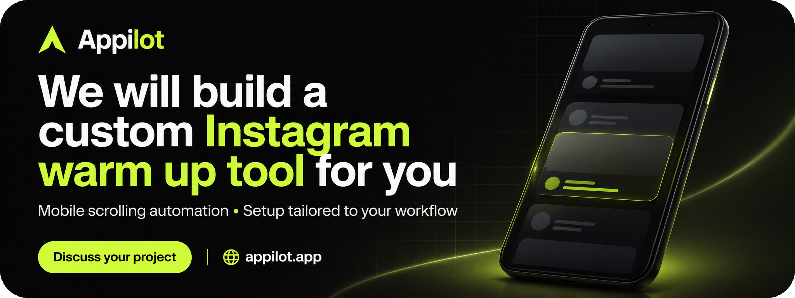
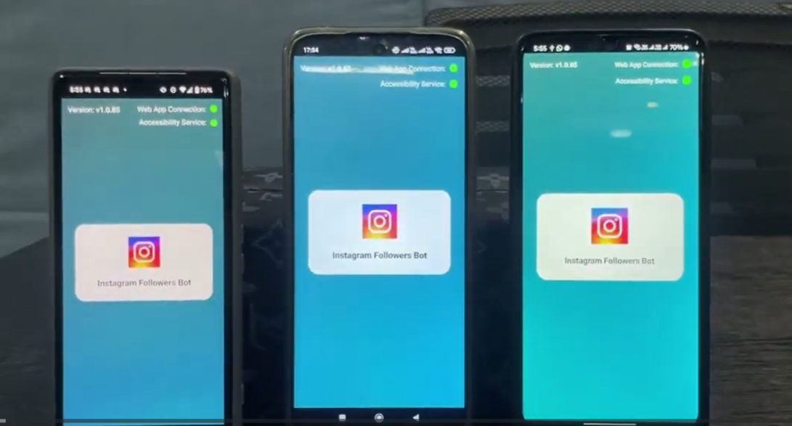
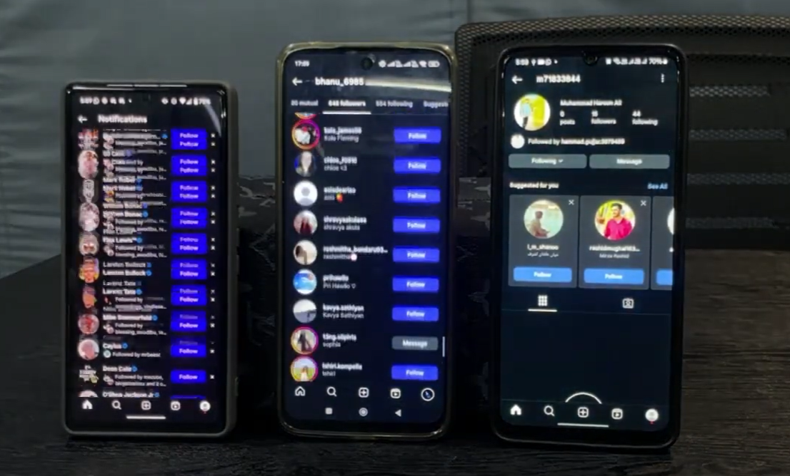

# Instagram Auto Scrolling Tool

[](https://www.appilot.app/contact)

**Custom mobile Instagram scrolling workflow by Appilot, scoped around authorized accounts, bounded sessions and operator control.**


## Overview

An Instagram auto scrolling tool can reduce repetitive navigation in a defined mobile workflow. Appilot can scope a custom Instagram warm up tool around your devices, approved browsing tasks and operational requirements. “Warm up” describes the requested workflow; scrolling alone does not establish account trust or guarantee reach.

**Need a custom version? [Tell Appilot about your workflow →](https://www.appilot.app/contact)**

## Watch the Demo

[Watch the project demo](https://youtu.be/_nDy-zUhhps)

The supplied video is a project reference. Confirm the final custom scope in a walkthrough.

## What the Software Can Manage

| Area | Evidence or proposed scope |
|---|---|
| Device selection | Select the authorized device and account for the agreed workflow. |
| Scrolling sessions | Scope bounded feed navigation with explicit start and stop conditions. |
| Operator controls | Specify manual pause and stop controls and escalation on unexpected screens. |
| Run records | Agree useful completion and exception records without storing secrets. |

## Typical Use Cases

- Repetitive feed navigation on an authorized test device.
- Repeatable mobile UI walkthroughs with operator supervision.
- A scoped browsing workflow for a team-owned account.

## How It Works

The following is the proposed delivery workflow, not an installation guide:

1. **Define the task.** Share a recording of the manual process and identify authorized accounts, devices or profiles.
2. **Agree boundaries.** Specify permitted actions, exclusions, completion criteria and when an operator must take over.
3. **Prepare a pilot.** Validate the environment and demonstrate a limited workflow with non-sensitive test inputs.
4. **Review outcomes.** Check normal completion, unexpected screens, interruption and recovery. Stop when the outcome is uncertain.
5. **Approve handoff.** Confirm configuration, access controls, operating instructions and support responsibilities.

## Product Screenshots

These are the original user-supplied screenshots, not AI-generated product mockups. The banner above is an AI-generated marketing visual.

### Mobile app connection screen



User-supplied photo of three Android devices showing an interface labelled Instagram Followers Bot, with connection and accessibility status indicators. This is a mobile automation reference, not a scrolling-specific screen.

### Instagram on multiple devices



User-supplied photo of Instagram notification, follow-list and profile screens. The image illustrates the mobile environment; it does not demonstrate warm-up effectiveness.

## Core Modules

These are proposed implementation responsibilities; the production stack and module boundaries must be confirmed during discovery.

| Module | Purpose |
|---|---|
| Task configuration | Capture approved scope, inputs and completion criteria. |
| Account or profile context | Validate the intended authorized execution environment. |
| Workflow runner | Perform the agreed steps with bounded execution. |
| Operator controls | Provide stopping, review and recovery paths. |
| Outcome reporting | Record minimal status and exceptions without secrets. |

See [architecture and acceptance checks](docs/architecture.md).

## Repository Structure

```text
instagram-auto-scrolling-tool/
  assets/
    banner.png
    instagram-mobile-app.png
    instagram-device-screens.png
  docs/
    architecture.md
    media-notes.md
  .gitignore
  CONTRIBUTING.md
  LICENSE
  README.md
  REPOSITORY-SETUP.md
  SECURITY.md
```

Only one AI-generated image is included: `assets/banner.png`. All other images are supplied screenshots. No generated workflow illustrations are included.

## Customization Options

- Supported Android devices and app versions
- Permitted navigation and session duration
- Operator controls and exception handling
- Activity reporting and handoff documentation

Pricing depends on the agreed scope, environment, integrations and support. [Request a custom quote](https://www.appilot.app/contact); no fixed price or delivery date is implied by this showcase.

## Responsible Use

No automatic following, mass messaging, artificial engagement or restriction-bypass functionality is promised. The supplied images depict a broader followers-bot interface; do not treat them as evidence that the proposed scrolling controls are implemented.

Use only accounts and systems you own or are explicitly authorized to operate. Review applicable platform rules before deployment. Keep passwords, tokens and session data out of public repositories. Stop on login challenges, access restrictions or unexpected states rather than attempting to bypass them. Confirm review requirements for public-facing actions.

## Frequently Asked Questions


### Can the workflow be adapted to my business?

Appilot can evaluate your process, devices and integration requirements. Share a representative manual workflow without secrets and agree a limited pilot before expanding the scope.

### Are the screenshots real?

They are user-supplied project screenshots, preserved unchanged. Captions distinguish what is visible from what still needs to be implemented or verified.


## Build Your Custom Automation Tool

**Appilot can help scope a custom tool around your workflow.** Bring the repetitive task; agree the controls, success criteria and support you need.

[Discuss your project and request custom pricing →](https://www.appilot.app/contact)

[Visit Appilot](https://www.appilot.app/) · [Contact Appilot](https://www.appilot.app/contact)

