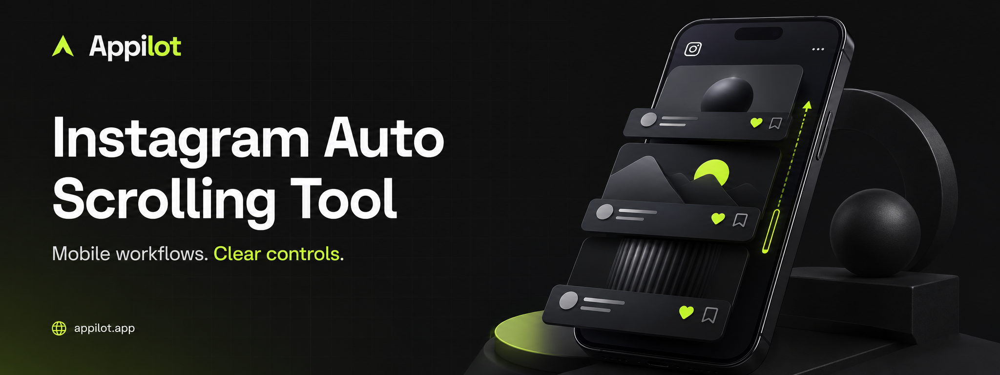
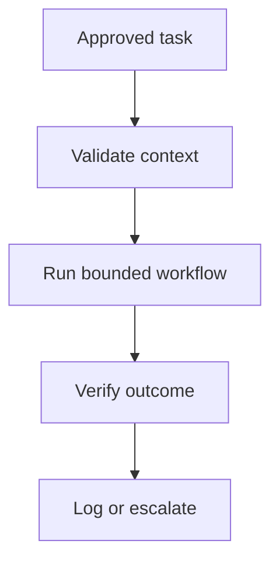
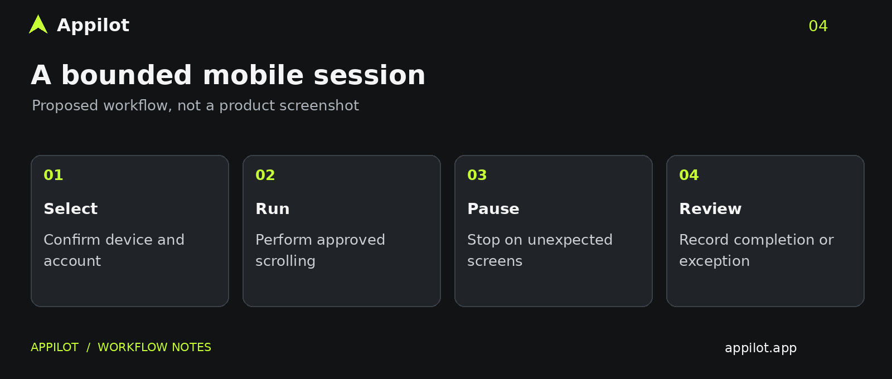
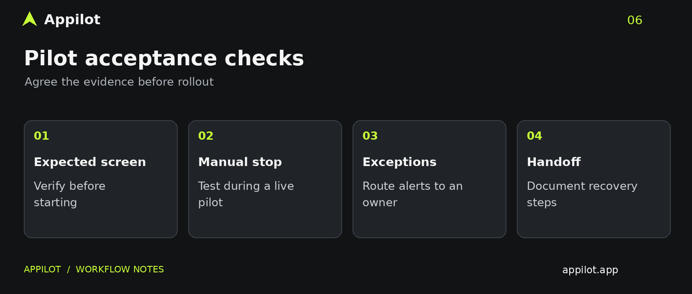

# Instagram Auto Scrolling Tool — Appilot

> Mobile Instagram scrolling workflow blueprint with session controls, operator review and activity logs for authorized accounts.

  &nbsp;
  &nbsp;
  

## What is this project?

This public showcase describes the scope and operating model for a custom **instagram auto scrolling tool**. It is designed for teams with authorized accounts and a defined business workflow. Like the reference showcase, it is documentation and a project brief—not a ready-to-run application.

The requested environment is **mobile-based automation**. Final capabilities, integrations and deployment requirements must be agreed during discovery and demonstrated in a pilot. No source code or executable bot was provided for this package.

This is not a follower-growth, auto-like or mass-DM tool. Scrolling does not guarantee reach, account trust or protection from restrictions.

## Why a complete workflow matters

A useful automation project needs more than repeated actions. The operator must know which account or profile is active, what is allowed, what counts as completion and when a person must take over. Unclear outcomes create rework; unattended retries can make an ordinary exception harder to recover from.

Appilot can discuss a custom implementation around these requirements. The capabilities below are proposed scope, not an assertion that an unseen product already implements them.

## What Appilot can scope for you

| Workflow layer | Proposed delivery requirement |
|---|---|
| Account context | Confirm the authorized account and selected mobile device. |
| Bounded scrolling | Define the permitted browsing task and session duration. |
| Operator control | Specify manual stopping and pause-on-unexpected-screen behavior. |
| Run evidence | Record completion and exceptions without exposing credentials. |
| Pilot handoff | Test on representative devices and document recovery. |

## How the system is intended to work

1. Define the business task, ownership, exclusions and acceptance evidence.
2. Select the authorized device and account.
3. Validate the expected state before starting an approved task.
4. Execute only the agreed workflow; stop on an unexpected state.
5. Verify completion, record the outcome and route exceptions to a person.

## Workflow illustrations

These are explanatory diagrams, **not screenshots of a running product**.

## Reference architecture

| Layer | Design responsibility |
|---|---|
| Inputs | Authorized task scope and account/profile assignment |
| Control | Validation, scheduling boundaries and operator permissions |
| Execution | Approved mobile workflow on the agreed devices |
| Evidence | Outcome checks, minimal logs and exception records |
| Oversight | Human review, manual stopping and documented recovery |

The final stack is selected after reviewing the actual environment. Do not infer compatibility, concurrency limits or production readiness from this diagram.

## Getting started with a custom build

This repository has no installation command because it does not contain an application. To begin an implementation engagement:

1. Record a representative manual task and provide sample inputs without secrets.
2. Document the mobile devices and app versions in scope.
3. Agree allowed actions, prohibited actions, completion checks and exception owners.
4. Request a limited pilot with normal, failure and recovery cases.
5. Approve a handoff including configuration instructions, access requirements and support scope.

## Watch the project demo

[Watch the supplied project demo](https://youtu.be/_nDy-zUhhps)

The supplied video is a project reference; confirm requested safeguards during a scoped walkthrough.

## Product screenshots and testimonials

Project-specific screenshots and testimonial videos were not supplied for this project. They are not fabricated or copied from another brand. See [the media manifest](assets/MEDIA-MANIFEST.md) for included illustrations and the assets still needed before launch.

## Operating safeguards

- Use only accounts, profiles and data you own or are explicitly authorized to manage.
- Review platform rules and permission requirements before deployment.
- Keep credentials, session tokens and personal information out of public files and logs.
- Pause on login challenges, unexpected screens, restrictions or uncertain outcomes.
- Require human review for public-facing or consequential actions.
- Agree retention, access removal and incident handling with the account owner.
- Do not claim guaranteed engagement, rankings, karma, revenue or immunity from restrictions.

## Who this is for

Operations teams, agencies and business owners who need a clearly scoped mobile workflow, documented boundaries and accountable handoff. It is not intended for anonymous mass activity, deceptive promotion or bypassing platform controls.

## Build your workflow with Appilot

Tell us what your team does today, which steps repeat and where exceptions need human judgment. We can discuss a scoped implementation with clear inputs, operating limits and acceptance criteria.

**[Discuss your custom automation project →](https://www.appilot.app/contact)**

[Appilot](https://www.appilot.app/) · [Contact](https://www.appilot.app/contact)
